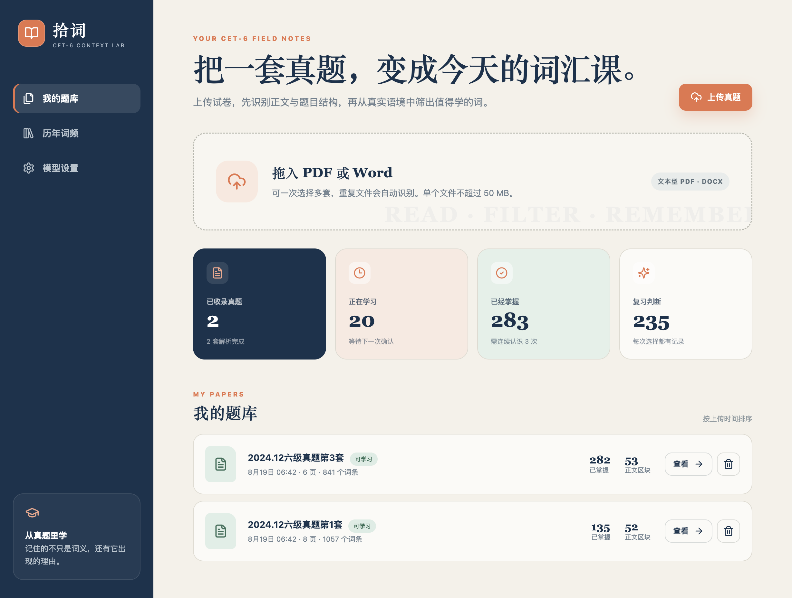
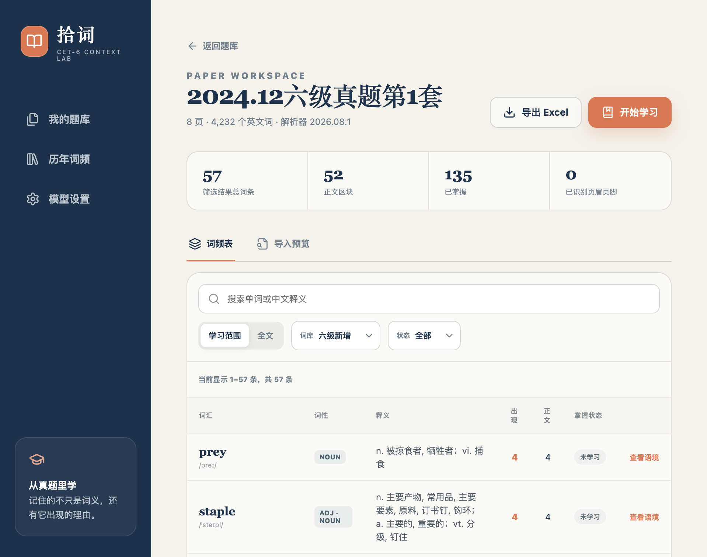
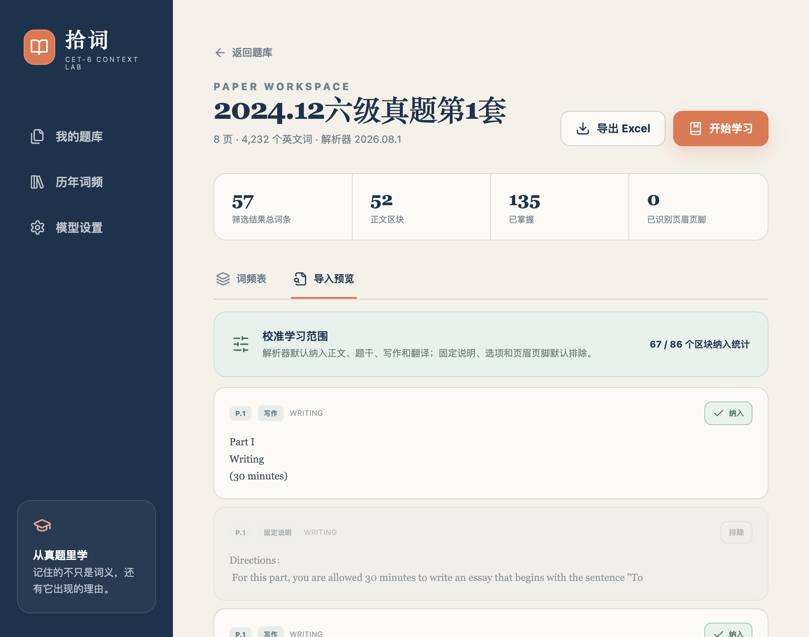
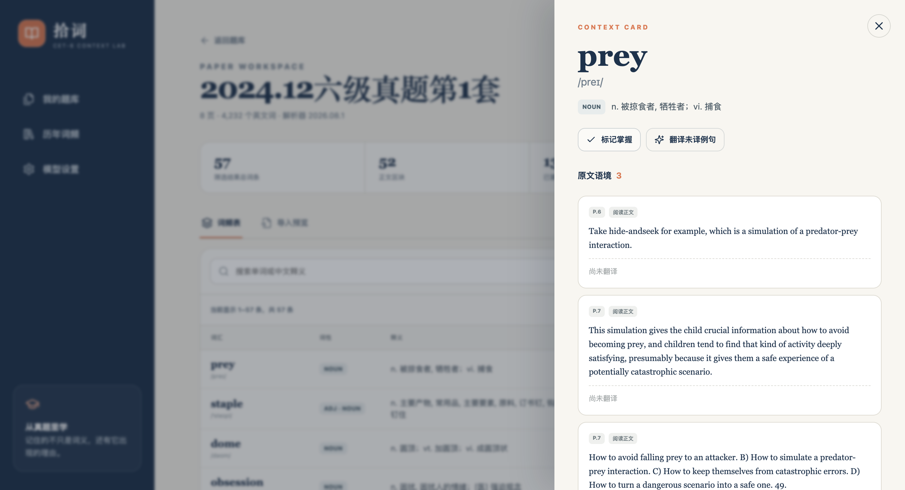
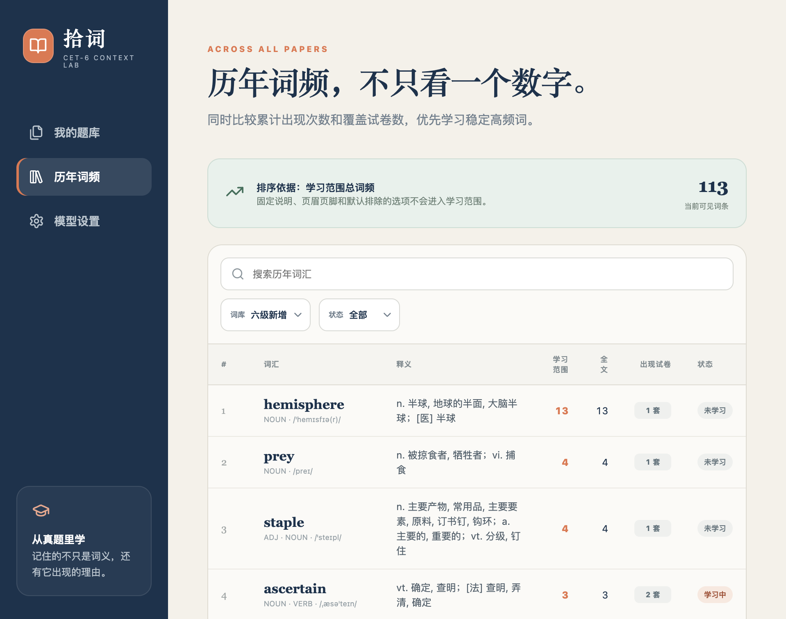
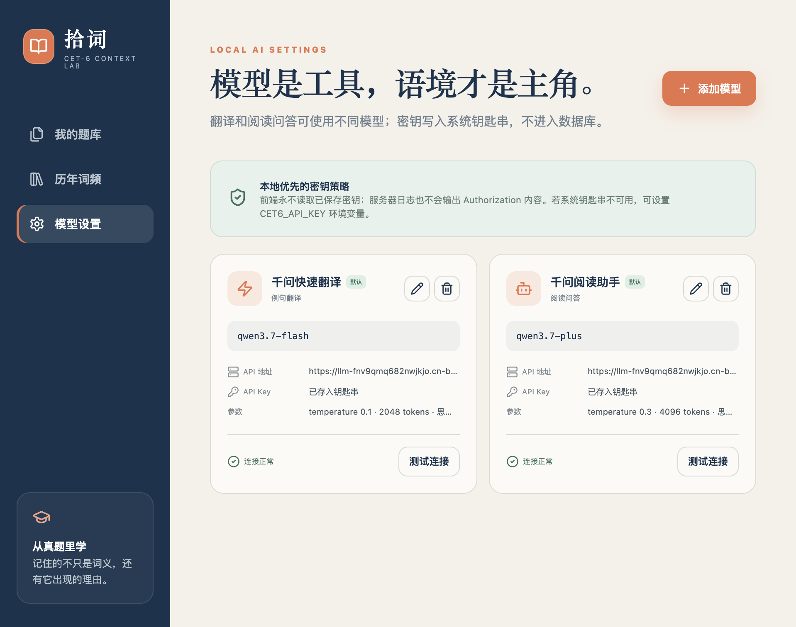

# 拾词 · 词汇学习助手

一个在本机运行的六级真题词汇学习工具。上传 PDF 或 DOCX 后，应用会识别文章、题干、选项、固定说明和页眉页脚，生成词频表并提供语境卡片学习。

## 打开应用

macOS 上双击 `start.command`。首次运行如缺少依赖，会自动调用 `setup.command` 安装。应用启动后默认打开：

`http://127.0.0.1:8001/`

关闭启动脚本所在的终端窗口即可停止服务。真题、数据库和模型设置只保存在本项目的 `backend/data` 目录。

## 功能预览

下面按一套真题从上传到掌握的典型流程，展示各页面的核心功能与交互。

### 1. 题库首页：上传真题与学习概览

首页是进入应用的起点，把“上传—解析—学习”串成一条动线：

- **拖拽上传区**：支持一次拖入多份 PDF 或 DOCX 真题，按文件哈希去重，重复文件会提示“已在题库中”。
- **学习概览卡片**：四张指标卡分别展示已收录真题数、正在学习词数、已掌握词数（需连续认识 3 次）和累计复习判断次数，一眼看清整体进度。
- **我的题库列表**：按上传时间排列每套真题，展示页数、词条数、已掌握数与正文区块数；解析中的试卷会显示进度条与当前阶段，失败时可一键重新解析或删除。

### 2. 词频表：从真实语境筛出值得学的词

进入某套真题后默认打开“词频表”标签，是单词学习的核心工作台：

- **多维筛选**：可按“学习范围/全文”切换统计口径，按词库（六级新增/四级基础/全部）和掌握状态过滤，支持按单词或中文释义搜索。
- **词频对照**：每行展示单词、词性、音标、释义，以及“出现次数”和“正文出现次数”，优先学习高频且出现在正文的词。
- **一键标记掌握**：点击右侧掌握状态按钮即可将单词标记为“已掌握”，状态会同步更新到上方的 KPI 区块。
- **查看语境**：点击任意行打开右侧语境抽屉，查看原文例句与 AI 翻译。顶部支持导出 Excel 词频表和直接进入卡片学习。

### 3. 导入预览：校准每套试卷的学习范围

解析器会把每页切成不同类型的内容区块，这里允许人工复核：

- **区块类型识别**：每个区块标注页码、类型（阅读正文、题干、选项、固定说明、页眉页脚、听力、写作、翻译等）和所属小节。
- **纳入/排除切换**：解析器默认纳入正文、题干、写作和翻译，排除固定说明、选项和页眉页脚；可逐块调整，改动后词频表会即时刷新。
- **范围统计**：顶部显示当前纳入区块数与总区块数，确保统计口径符合你的学习目标。

### 4. 语境抽屉：例句、翻译与阅读问答

在词频表中点击任意单词，右侧滑出语境卡片：

- **词卡信息**：展示单词、音标、词性与释义，可一键标记/撤销掌握。
- **原文语境列表**：列出该词在本套真题中的全部出处例句，标注页码与类型；点击“翻译未译例句”调用翻译模型批量补全中文，结果会缓存复用。
- **问 AI**：在底部输入框针对当前语境提问（例如“这里为什么用过去分词”），AI 结合原文与释义给出 Markdown 格式的回答。

### 5. 卡片学习：认识 / 不认识 与穿插复现

从词频表点击“开始学习”进入卡片模式：

- **正反两面卡片**：正面只显示单词、词级与音标，点击翻面查看释义、词性与原文例句；例句可单独翻译。
- **认识 / 不认识**：点击“认识”进入学习中状态，累计认识 3 次后标记为已掌握；点击“不认识”则该词会在 5 张卡片后穿插复现，再次不认识则间隔延长到 15 张。
- **进度与总结**：顶部进度条实时反映本轮完成度；全部走完后展示认识数、待巩固数和穿插复现次数，可选择“再学未掌握”或返回词频表。

### 6. 历年词频：跨试卷稳定高频词

切到“历年词频”页可把所有已解析真题汇总比较：

- **排序依据**：按“学习范围总词频”排序，固定说明、页眉页脚和默认排除的选项不计入。
- **多维度对照**：每行同时展示学习范围词频、全文词频和出现试卷数，优先学习在多套试卷中稳定出现的高频词。
- **筛选与搜索**：可按词库（六级/四级/全部）、掌握状态过滤，并支持搜索历年词汇。

### 7. 模型设置：翻译与问答分别配置

在“模型设置”页管理 AI 翻译和阅读问答使用的模型：

- **多模型管理**：可为“例句翻译”和“阅读问答”分别配置不同模型，每个任务保留一个默认配置；卡片上展示 API 地址、模型名称、参数和连接测试状态。
- **密钥安全**：API Key 写入系统钥匙串，前端永不读取已保存密钥，服务器日志也不会输出 Authorization 内容；钥匙串不可用时可改用 `CET6_API_KEY` 环境变量。
- **连接测试**：每张卡片可一键测试连接，失败会在卡片上标注“上次测试失败”，方便排查。

## 当前功能

- PDF、DOCX 上传和文件哈希去重
- 页面区块、内容类型与学习范围识别
- CET-4/CET-6 分级词库、词性标注、词形还原、音标和中文释义
- 单套题学习词频、全文词频、正文词频和跨试卷词频
- 例句详情、按需 AI 翻译和阅读问答
- “认识 / 不认识”卡片与穿插复现；连续认识 3 次后标记掌握
- 导入预览，可人工纳入或排除区块
- Excel 词频表与例句明细导出
- 翻译模型和对话模型分别配置，API Key 保存到系统钥匙串

## 数据来源

内置词表和词典数据整理自 [ismartcoding/endict](https://github.com/ismartcoding/endict)，遵循 MIT License；项目内保留了原许可证。词表在数据库和接口中保留来源、等级和版本字段。

## 已知限制

- 当前支持文本型或已有 OCR 文本层的 PDF，不主动对纯图片页执行 OCR。
- 双栏及低质量 OCR 文件可能出现顺序或字符错误，请在“导入预览”中校准学习范围。
- AI 翻译和问答需要在“模型设置”中配置可用的 API Key。
